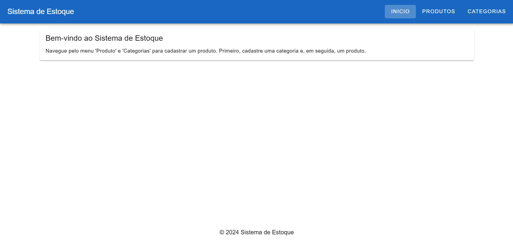
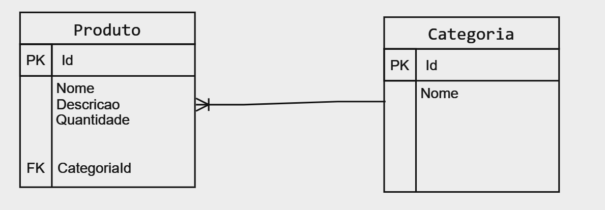

# Sistema de Estoque

 

## Antes de rodar, instale as dependências com o seguinte comando:

npm install

## Foi utilizado o **concurrently** para rodar o backend juntamente com o frontend, através do comando npm run dev. Portanto, instale o **concurrently** com o seguinte comando:

npm install concurrently

## Após a instalação, inicie o projeto com o seguinte comando no diretório do projeto:

npm run dev

### Em seguida, acesse a seguinte URL no navegador: http://localhost:3000

## URLs dos endpoints:

http://localhost:5202/api/produto

http://localhost:5202/api/Categoria

## Tecnologias utilizadas:

-SqlLite

-VueJS

-Nuxt 

-Vuetify

-C#

## Modelagem:

## Json utilizado para teste do POST:

[
  {
    "Id": 1,
    "Nome": "Eletrônicos"
  },
  {
    "Id": 2,
    "Nome": "Roupas"
  }
]

[
  {
    "Id": 1,
    "Nome": "Smartphone Xiaomi Redimi",
    "Descricao": "Smartphone com tela de 6.5 polegadas, 128GB de armazenamento",
    "Quantidade": 50,
    "CategoriaId": 1
  },
  {
    "Id": 2,
    "Nome": "Playstation 5",
    "Descricao": "Console Playstation 5 Vem acompanhado 2 controles e um jogo",
    "Quantidade": 6,
    "CategoriaId": 1
  },
  {
    "Id": 3,
    "Nome": "Camisa Polo",
    "Descricao": "Camisa Polo com várias cores",
    "Quantidade": 6,
    "CategoriaId": 2
  }
]
